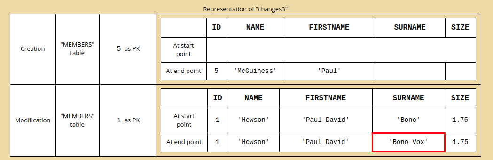

AssertJ-DB概念
======
假设有下面两张表:
MEMBERS:

| ID | NAME | FIRSTNAME | SURNAME | BIRTHDATE | SIZE |
|--------|--------|--------|--------|--------|--------|
|    1    |    'Hewson'    | 'Paul David' | 'Bono' | 05-10-60 | 1.75 |
|    2    |    'Evans'    | 'David Howell' | 'The Edge' | 08-08-61 | 1.77 |
|    3    |    'Clayton'    | 'Adam' || 03-13-60 | 1.78 |
|    4    |    'Mullen'    | 'Larry' || 10-31-61 | 1.70 |

ALBUMS

| ID | RELEASE | TITLE | NUMBEROFSONGS | DURATION | LIVE |
|--------|--------|--------|--------|--------|--------|
|    1    |    10-20-80    | 'Boy' | 12 | 42:17 |  |
|    2    |    10-12-81    | 'October' | 11 | 41:08 |  |
|    3    |    02-28-83    | 'War' | 10 | 42:07 |  |
|    4    |    11-07-83    | 'Under a Blood Red Sky' | 8 | 33:25 | true |
|    5    |    10-01-84    | 'The Unforgettable Fire' | 10 | 42:42 |  |
|    6    |    06-10-85    | 'Wide Awake in America' | 4 | 20:30 | true |
|    7    |    03-09-87    | 'The Joshua Tree' | 11 | 50:11 |  |
|    8    |    10-10-88    | 'Rattle and Hum' | 17 | 72:27 |  |
|    9    |    11-18-91    | 'Achtung Baby' | 12 | 55:23 |  |
|    10    |    07-06-93    | 'Zooropa' | 10 | 51:15 |  |
|    11    |    03-03-97    | 'Pop' | 12 | 60:08 |  |
|    12    |    10-30-00    | 'All That You Can't Leave Behind' | 11 | 49:23 |  |
|    13    |    11-22-04    | 'How to Dismantle an Atomic Bomb' | 11 | 49:08 |  |
|    14    |    03-02-09    | 'No Line on the Horizon' | 11 | 53:44 |  |
|    15    |    09-09-14    | 'Songs of Innocence' | 11 | 48:11 |  |

<!-- toc -->
####链接数据库
使用数据库的断言，有必要进行连接。无论是使用DataSource或Source

######DataSource
[DataSource](http://docs.oracle.com/javase/6/docs/api/javax/sql/DataSource.html)是经典的java[连接](http://docs.oracle.com/javase/6/docs/api/java/sql/Connection.html)数据库方式

######Source
Source是你不想访问数据库也不想使用DataSource的一种方式,它允许通过构造方法传递必要的链接信息.下面这个例子是使用Source链接到H2数据库。
```java
Source source = new Source("jdbc:h2:mem:test", "sa", "");
```

######DataSource与LetterCase
[DataSourceWithLetterCase](http://joel-costigliola.github.io/assertj/db/current/api/org/assertj/db/type/DataSourceWithLetterCase.html)是一个DataSource的实例,它允许指定tables, columns和primary keys是哪个[LetterCase](http://joel-costigliola.github.io/assertj/db/current/api/org/assertj/db/type/lettercase/LetterCase.html)
```java
DataSource ds = new DataSourceWithLetterCase(dataSource, tableLetterCase, columnLetterCase,pkLetterCase);
```
想要了解更多,请查看[这里](http://joel-costigliola.github.io/assertj/assertj-db-concepts.html#dblettercase)

####数据库元素
######Table
[Table](http://joel-costigliola.github.io/assertj/db/current/api/org/assertj/db/type/Table.html)表示的是数据中的表
一个Table需要一种方法来链接数据库,还需要指定一个表明
```java
// Get a DataSource
DataSource dataSource = ...
// 声明一个dataSource下的名为members的表
Table table1 = new Table(dateSource, "members");
//  声明一个Source下的名为members的表
Table table2 = new Table(source, "members");
```
以上代码中的table1和table2都表示的是:
MEMBERS:

| ID | NAME | FIRSTNAME | SURNAME | BIRTHDATE | SIZE |
|--------|--------|--------|--------|--------|--------|
|    1    |    'Hewson'    | 'Paul David' | 'Bono' | 05-10-60 | 1.75 |
|    2    |    'Evans'    | 'David Howell' | 'The Edge' | 08-08-61 | 1.77 |
|    3    |    'Clayton'    | 'Adam' || 03-13-60 | 1.78 |
|    4    |    'Mullen'    | 'Larry' || 10-31-61 | 1.70 |

你也可以在构造方法中指定包含或者排除的字段
```java
//获取包含id和name字段的members表
Table table3 = new Table(source, "members", new String[] { "id", "name" }, null);
//获取不包含birthdate字段的members表
Table table4 = new Table(source, "members", null, new String[] { "birthdate" });
// 获取只包含name字段的members表 (如果id又包含又排除,那么最终会被排除)
Table table5 = new Table(source, "members", new String[] { "id", "name" }, new String[] { "id" });
```
"table3"表示:

| ID | NAME |
|--------|--------|
|    1    |    'Hewson'   |
|    2    |    'Evans'    |
|    3    |    'Clayton'  |
|    4    |    'Mullen'   |

table4表示:

| ID | NAME | FIRSTNAME | SURNAME | SIZE |
|--------|--------|--------|--------|--------|--------|
|    1    |    'Hewson'    | 'Paul David' | 'Bono' | 1.75 |
|    2    |    'Evans'    | 'David Howell' | 'The Edge' |  1.77 |
|    3    |    'Clayton'    | 'Adam' ||  1.78 |
|    4    |    'Mullen'    | 'Larry' || 1.70 |

table5表示:

| NAME |
|--------|
|    'Hewson'   |
|    'Evans'    |
|    'Clayton'  |
|    'Mullen'   |

######Request
[Request](http://joel-costigliola.github.io/assertj/db/current/api/org/assertj/db/type/Request.html)表示数据库中的SQL语句
```java
DataSource dataSource = ...
Request request1 = new Request(source,"select name, firstname from members where id = 2 or id = 3");

Request request2 = new Request(dataSource,"select name, firstname from members where id = 2 or id = 3");
```
以上代码得到以下结果：

| NAME | FIRSTNAME | SURNAME |
|--------|--------|--------|
|   'Evans'    | 'David Howell' | 'The Edge' |
|　'Clayton'   | 'Adam' ||

Request可以有一个或多个参数
```java
Request request3 = new Request(dataSource,
                               "select name, firstname from members " +
                               "where name like ?;",
                               "%e%");

Request request4 = new Request(dataSource,
                               "select name, firstname from members " +
                               "where name like ? and firstname like ?;",
                               "%e%",
                               "%Paul%");
```

######Changes
[Changes](http://joel-costigliola.github.io/assertj/db/current/api/org/assertj/db/type/Changes.html)是数据库在起点(start point)和终点(end point)之间的状态:

假设在起点到终点之间有这些SQL语句:
```sql
DELETE FROM ALBUMS WHERE ID = 15;
INSERT INTO MEMBERS(ID, NAME, FIRSTNAME) VALUES(5, 'McGuiness', 'Paul');
UPDATE MEMBERS SET SURNAME = 'Bono Vox' WHERE ID = 1;
UPDATE ALBUMS SET NAME = 'Rattle & Hum', LIVE = true WHERE ID = 8;
```
```java
// Get a DataSource
DataSource dataSource = ...
// 这些change可以在dataSource也可以在source
Changes changes1 = new Changes(dataSource);
Changes changes2 = new Changes(source);
// change可以发生在table也可以发生在request
Changes changes3 = new Changes(table4);
Changes changes4 = new Changes(request3);
Changes changes5 = new Changes(request4);
//name是表中主键字段的值
// request中需要设置主键
Changes changes6 = new Changes(request4).setPksName("name");
```
chang1和chang2相等,chang4和chang5也相等
(下面这段太难懂了所以就直接复制过来了,希望以后理解了再来处理)
The changes are ordered :

First by the type of the change : creation, modification and after deletion
After if it a change on a table by the name of the table
To finish by the values of the primary key and if there are no primary key by the values of the row (for a modification)
As indicated above, the primary key is used to order the changes. But more important, the primary key is used to determinate which rows at the same with modifications.
In Representation of "changes4" or "changes5" the modification of first row of the table become a creation and deletion.


######Change
[Change](http://joel-costigliola.github.io/assertj/db/current/api/org/assertj/db/type/Change.html)是Changes中的一个元素
下面changes3的图片中的红色部分就是一个Change：


######Row
[Row](http://joel-costigliola.github.io/assertj/db/current/api/org/assertj/db/type/Row.html)可以表示一个Table中的行,也可以是一个Request或者一个Change中的行
下面table4中的红色部分就是一个Row:


下面request3中的红色部分表示一个Row


下面changes3中的红色部分表示一个Row


######Column
[Column](http://joel-costigliola.github.io/assertj/db/current/api/org/assertj/db/type/Column.html)可以表示一个Table中的列,也可以是一个Request或者一个Change的列
下面table4中的红色部分就是一个Column


下面request3中的红色部分就是一个Column


下面changes3中的红色部分表示一个Column


######Value
Value可以在Row中也可以在Column中
table4中的第二row的第二个value和table4中的第二column的第三个value


request3中的第二row的第二个value和第二column的第二个value:


changes3第二个change的第四个row的value和第二个change的第第个column的value




######Type
1. DataType
	之前提到的三个数据库的根元素,只有Table和Request是数据元素.
    所有可能的数据类型被包含在[DataType](http://joel-costigliola.github.io/assertj/db/current/api/org/assertj/db/type/DataType.html)枚举中
    这个类型可以是:
    - Table
    - Request

1. ChangeType
	change的类型可以是创建,修改或者删除。
    所有的change类型都包含在[ChangeType](http://joel-costigliola.github.io/assertj/db/current/api/org/assertj/db/type/DataType.html)枚举中
    change类型根数据库的操作类型对应:
    - CREATION是insert SQL请求
    - MODIFICATION是upadte　SQL请求
    - DELETION是delete　SQL请求

1. ValueType
	value的类型可以是日期型,布尔型或者文本型
     所有可能的数据类型被包含在[ValueType](http://joel-costigliola.github.io/assertj/db/current/api/org/assertj/db/type/ValueType.html)枚举中
     value的类型取决与从数据库读取出来的对象的类型:
     - BYTES　是一个byte数组(byte[])
     - BOOLEAN 是java.lang.Boolean
     - Text 是java.lang.String
     - DATE 是java.sql.Date
     - TIME 是java.sql.time
     - DATE_TIME　是java.sql.Timestamp
     - UUID 是java.util.UUID
     - NUMBER 是java.lang.Byte,java.lang.Short,java.lang.Integer,java.lang.Long,java.lang.Float或者java.math.BigDecimal
     - NOT_IDENTIFIED　是其他的类型(比如说null)

####Navigation(导航)
navigation是可以提供不能的级别和指示到达子元素内，并且返回到根元素能力的断言。请看Navigation[例子](https://github.com/joel-costigliola/assertj-examples/blob/master/assertions-examples/src/test/java/org/assertj/examples/db/NavigationExamples.java)

######Table或者Request做根断言
可以在Table上创建一个根断言
```java
import static org.assertj.db.api.Assertions.assertThat;

assertThat(table)...
```
也可以在Request上创建:
```java
import static org.assertj.db.api.Assertions.assertThat;

assertThat(request)...
```
从这些根断言，能够导航到子元素，并返回到根元素如下面的图片:


更多细节请查看[这里](http://joel-costigliola.github.io/assertj/assertj-db-features-highlight.html#tableorrequestasroot)

######Changes做根断言
```java
import static org.assertj.db.api.Assertions.assertThat;

assertThat(changes)...
```
从该根断言，能够导航到子元素，并返回到根元素如下面的图片。


更多细节请查看[这里](http://joel-costigliola.github.io/assertj/assertj-db-features-highlight.html#tableorrequestasroot)

####DateValue, TimeValue 和 DateTimeValue
有4种静态方法来实例化这些值：
- of接收int类型参数
    ```java
    DateValue dateValue = DateValue.of(2007, 12, 23);

    // 小时和分钟
    TimeValue timeValue1 = TimeValue.of(9, 1);
    // 时分秒
    TimeValue timeValue2 = TimeValue.of(9, 1, 6);
    // 时分秒纳秒
    TimeValue timeValue3 = TimeValue.of(9, 1, 6, 3);

    // 日期(小时是0,即午夜0时)
    DateTimeValue dateTimeValue1 = DateTimeValue.of(dateValue);
    //日期和时间
    DateTimeValue dateTimeValue2 = DateTimeValue.of(dateValue, timeValue1);
    ```
- from等效于从java.sql 包(java.sql.Date, java.sql.Time 和 java.sql.Timestamp)或者java.util.Calendar包接收参数
	```java
    Date date = Date.valueOf("2007-12-23");
    DateValue dateValue = DateValue.from(date);

    Time time = Time.valueOf("09:01:06");
    TimeValue timeValue = TimeValue.from(time);

    Timestamp timestamp = Timestamp.valueOf("2007-12-23 09:01:06.000000003");
    DateTimeValue dateTimeValue = DateTimeValue.from(timestamp);

    Calendar calendar = Calendar.getInstance();
    DateValue dateValueFromCal = DateValue.from(calendar);
    TimeValue timeValueFromCal = TimeValue.from(calendar);
    DateTimeValue dateTimeValueFromCal = DateTimeValue.from(calendar);
	```

- parse接收字符串(该方法可能会抛出一个ParseException异常)
	```java
    DateValue dateValue = DateValue.parse("2007-12-23");

    // 小时分钟
    TimeValue timeValue1 = TimeValue.parse("09:01");
    // 时分秒
    TimeValue timeValue2 = TimeValue.parse("09:01:06");
    // 时分秒纳秒
    TimeValue timeValue3 = TimeValue.parse("09:01:06.000000003");

    //日期(小时是0,即午夜0时)
    DateTimeValue dateTimeValue1 = DateTimeValue.parse("2007-12-23");
    //日期和时间
    DateTimeValue dateTimeValue2 = DateTimeValue.parse("2007-12-23T09:01");
    DateTimeValue dateTimeValue2 = DateTimeValue.parse("2007-12-23T09:01:06");
    DateTimeValue dateTimeValue2 = DateTimeValue.parse("2007-12-23T09:01:06.000000003");
    ```

- now创建当前时间的实例
	```java
    DateValue dateValue = DateValue.now();                   // The current date
    TimeValue timeValue = TimeValue.now();                   // The current time
    DateTimeValue dateTimeValue = DateTimeValue.now();       // The current date/time
    ```

####默认的描述
在assertj中，你可以实现[Descriptable]()接口来增加一个描述,如果断言失败了那么这个描述会显示在错误信息中.
由于navigation在asserj-Db的存在,是的assertj-DB更加难以知道是哪个元素引发了错误,因此有一些默认的描述来帮助测试人员.
例如:
- "members table"一个在table中的断言
- "'select * from actor' request"一个在request中的断言
- "'select id, name, firstname, bi...' request"一个更多内容的request中的断言
- "Row at index 0 of members table"在一个table中的一个row的断言
- "Column at index 0 (column name : ID) of 'select * from members' request"一个在request中的一个column的断言
- "Value at index 0 of Column at index 0 (column name : ID) of 'select * from members' request"一个在request中的column中的断言
- "Value at index 0 (column name : ID) of Row at index 0 of 'select * from members' request"一个在request中的一个row中的一个value的断言
- "Value at index 0 (column name : ID) of Row at end point of Change at index 0 (on table : MEMBERS and with primary key : [4]) of Changes on tables of 'sa/jdbc:h2:mem:test' source" 一个在table中的change的end point的rou的value的断言

####Ouput
有时候debug的时候你想要查看数据库的数据,用output可以做到这点,例如:
```java
import static org.assertj.db.output.Outputs.output;

Table table = new Table(dataSource, "members");

//内容会输出到控制台
output(table).toConsole();
```
输出的内容如下:


上面的例子是控制台中显示纯文本,你也可以改变它
######输出类型
有两个已经实现的类型:
- PLAIN：文本内容，如上面例子所示(默认输出类型)
- HTML:HTML文档
```java
output(table).withType(OutputType.HTML).....;
```

######输出目标
有以下三种选择:
- 控制台输出(toConsole()方法)
- 输出到文件(toFile(String fileName)方法)
- 输出到流中(toStream(OutputStream outputStream)方法)
```JAVA
output(table).toConsole().withType(OutputType.HTML).toFile("test.html");
```


更多内容请查看[原文](http://joel-costigliola.github.io/assertj/assertj-db-concepts.html)