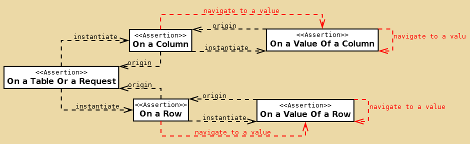

AssertJ-DB特性
======
看这边文章之前，建议先阅读[概念](concepts.md)
下面所有的例子都用的是概念文章中的两张表

<!-- toc -->
####Navigation
#####Table或者Request作为根断言
assertThat(...)方法表示一个table或一个request开始的断言
从table或者request开始基本都是以下面这种方式调用:
```java
assertThat(tableOrRequest)...
```
如果是有区别的将会被指定

所以的navigation方法都是从origin 点开始工作的

######to Row
ToRow接口的详情请查看[这里](http://joel-costigliola.github.io/assertj/db/current/api/org/assertj/db/api/navigation/ToRow.html)
```java
@Test
public void testNavigation(){
    Source source = new Source("jdbc:h2:mem:user-db;MODE=PostgreSQL;INIT=RUNSCRIPT FROM " +
            "'/home/oem/javaProject/other/java-test/assertj-core/src/test/resources/create_table.sql'", "sa", "");
    Table table = new Table(source, "MEMBERS");

    output(table).toConsole();
    assertThat(table).row().row().value("name").isEqualTo("Evans");
}
```

row(int index)方法允许导航到index指定的行
```java
// 导航到下标为２的行
assertThat(tableOrRequest).row(2)...

// 导航到下标为6的行
assertThat(tableOrRequest).row(2).row(6)...

// 下标为２的行的下一行,下标为3的行
assertThat(tableOrRequest).row(2).row()...
```

下面这个图红色部分表示从哪里开始可以导航到row


origin point是Table或者Request的row(...)方法,所以如果是从row,column或者value执行的,那么它们看起来就像从Table或者Request执行

当位置是在row,有可能回到origin
```java
//从table中的row中返回table
assertThat(table).row().returnToTable()...
//从request中的row中返回request
assertThat(request).row().returnToRequest()...
```

下面两个是等价的:
```java
assertThat(table).row().returnToTable().row()...

assertThat(table).row().row()...
```

######to Column
ToColumn接口的详情请查看[这里](http://joel-costigliola.github.io/assertj/db/current/api/org/assertj/db/api/navigation/ToColumn.html)
```java
// 导航到第一列
Source source = new Source("jdbc:h2:mem:user-db;MODE=PostgreSQL;INIT=RUNSCRIPT FROM " +
        "'/home/oem/javaProject/other/java-test/assertj-core/src/test/resources/create_table.sql'", "sa", "");
Table table = new Table(source, "MEMBERS");

assertThat(table).column().column().hasColumnName("name");
//导航到第二列
assertThat(tableOrRequest).column().column()...
```
```java
//导航到第二列
assertThat(table).column().column(1).hasColumnName("name");
//导航到第7列
assertThat(tableOrRequest).column(2).column(6)...
//导航到第4列
assertThat(tableOrRequest).column(2).column()...
//导航第1列
assertThat(tableOrRequest).row(2).column()...
//第4列
assertThat(tableOrRequest).row(2).column(3)...
//第五列
assertThat(tableOrRequest).column(3).row(2).column()...
```
```java
//name字段
assertThat(tableOrRequest).column("name")...
//id字段
assertThat(tableOrRequest).column("name").column().column(6).column("id")...
```
下图红色部分是表示从那些点开始执行可以导航到列上


```java
assertThat(table).column().returnToTable()...

assertThat(request).column().returnToRequest()...
```
下面两者相等:
```java
assertThat(table).column().returnToTable().column()...

assertThat(table).column().column().
```

######to a value
ToValue接口的详情可以看[这里](http://joel-costigliola.github.io/assertj/db/current/api/org/assertj/db/api/navigation/ToValue.html),ToValueFromRow接口的详情可以查看[这里](http://joel-costigliola.github.io/assertj/db/current/api/org/assertj/db/api/navigation/ToValueFromRow.html)
```java
//第一个value
assertThat(tableOrRequest).row().value()...
//第二个value
assertThat(tableOrRequest).column().value().value()...
```

```java
//第三个value
assertThat(tableOrRequest).column().value(2)...
//第七个
assertThat(tableOrRequest).row(4).value(2).value(6)...
//第４个value
assertThat(tableOrRequest).column(4).value(2).value()...
//第5个
assertThat(tableOrRequest).column().value(3).row(2).column(0).value()...
```

```java
//为name的value
assertThat(tableOrRequest).row().value("name")...
//为id的value
assertThat(tableOrRequest).row().value("surname").value().value(6).value("id")...
```
下图红色部分表示哪些点开始可以调用到value:



```java
assertThat(table).column().value().returnToColumn()...

assertThat(request).row().value().returnToRow()...
```
下面二者相等:
```java
assertThat(table).column().value().returnToColumn().value()...

assertThat(table).column().value().value()...
```

#####Changes作为根断言
######to Change
```java
//导航到创建
assertThat(changes).ofCreation()...
```

- 由于后续内容都比较简单,相信大家看到这里也应该明白它的大概用法了,若有兴趣可以请查看[原文](http://joel-costigliola.github.io/assertj/assertj-db-features-highlight.html)
- [这里](https://github.com/joel-costigliola/assertj-examples/tree/master/assertions-examples/src/test/java/org/assertj/examples/db)是使用案例,大家过一遍结合文章运用起来问题不大

