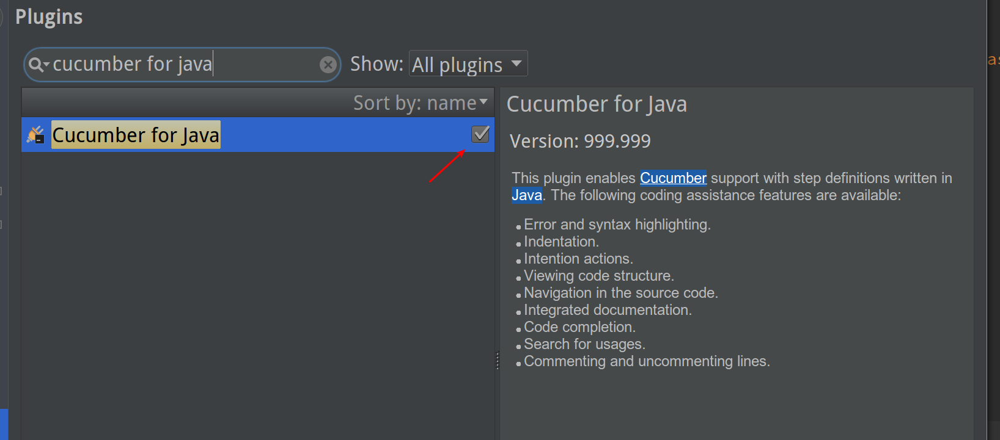
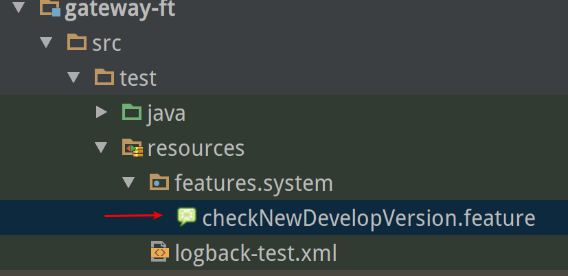
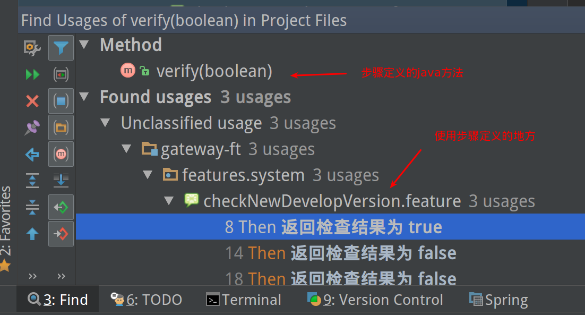

IntelliJ Idea
=============

> 注: 内容参考 https://www.jetbrains.com/help/idea/2016.1/cucumber.html

## 前提

IntelliJ Idea下默认安装有cucumber的插件，如果安装时没有勾选，可以再自行安装。

IntelliJ IDEA 支持 Cucumber for Java， cucumber的feature文件将被标记为

如图：

Cucumber 的支持包括:

- 语法和错误高亮
- "create step definitions/创建步骤定义"的快速修复

	即当feature文件中定义的step没有对应的定义时，可以"alt + enter"然后快速创建

- 在步骤和步骤定义之间导航

	在feature文件中按住"ctl"键，用鼠标点步骤，就可以跳到对应的步骤定义的java文件的具体代码行。

- 可以用英语或者任何其他在 `#language:` 注释中定义的语言来描述步骤
- Run/debug 配置
- 可以运行文件夹中的所有feature，单个feature，或者一个feature中的单独一个步骤。

## 创建步骤定义

如果 `.feature` 文件引用到一个不存在的步骤， IntelliJ IDEA的代码检验(code inspection)会觉察并高亮这个步骤，并提供一个引导行为(intention action)来帮助创建丢失的步骤定义。

创建一个丢失的步骤定义：

1. 在编辑 `.feature` 文件时，鼠标指到一个步骤定义的引用，IntelliJ IDEA会高亮步骤为未定义，并在tooltip中给出详细信息

	

2. 按 `Alt+Enter` 来显示 `Create Step Definition` 的intention action

	

	> 特别提醒：在这个`Create Step Definition` 的提示出来之后，直接敲回车就可以出来下面的步骤，不要理会这个三角形。因为进去之后反而找不到后面的步骤。

3. 从下拉列表中选择目标步骤定义文件：

	

	可以从建议列表中选择一个已经存在的步骤定义文件，或者创建一个新的。

	如果想创建一个新的步骤定义文件，请指定名称，类型，和父目录。

4. 在编辑器打开的被选择的步骤定义文件中，键入要求的代码。

	注意：编辑器会转为模板编辑模式，并用红框显示第一个高亮的输入字段。

    

## TIPs

- 查找使用步骤定义的地方

	和普通java代码类似，使用`alt + F7` 或者 鼠标右键点击步骤定义的java方法，就可以查找出所有使用这个步骤定义的

	

- IntelliJ IDEA 会始终关注步骤定义的唯一性。如果有相同名字的步骤定义会高亮显示。

	> 注：有点疑惑，测试中试过没有看到所谓高亮。待确认...

## 从.feature 文件导航到步骤定义

1. 在编辑器中打开 `.feature` 文件
2. 如下操作中的任意一个

	- 一直按着 `ctrl` 键，将鼠标移动到步骤上面。步骤会变成一个超链接，它的引用信息会在tooltip中显示：

		

		点击超链接。步骤定义会在编辑器中打开。

	- 在主菜单中，选择 Navigate | Declaration
	- 直接用快捷键 `Ctrl+B`

## 在Scenario Outline中创建Examples Table

IntelliJ IDEA 提供对Scenario Outline的支持，可以通过带有占位符的模板来描述多个情景。这些支持包括：

- 关键字的代码完成
- 关键字，占位符和属性的语法高亮
- 代码检测，用于探测找不到的examples，和生成example table stub的快速修改

