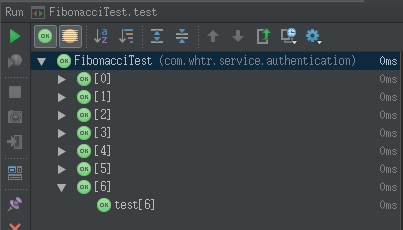
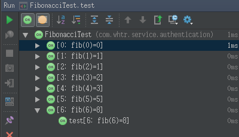

参数测试
------

*Parameterized* Runner实现了参数测试,当跑一个参数测试类的时候,它的实例是由测试方法和测试数据的元素交叉创建的

######举例,如下Fibonacci方法:
```java
    package com.junit.learning.parameterized;

    import org.junit.Test;
    import org.junit.runner.RunWith;
    import org.junit.runners.Parameterized;

    import java.util.Arrays;
    import java.util.Collection;

    import static org.assertj.core.api.Assertions.assertThat;

    @RunWith(Parameterized.class)
    public class FibonacciTest {

        @Parameterized.Parameters
        public static Collection<Object[]> data() {
            return Arrays.asList(new Object[][]{
                    {0, 0}, {1, 1}, {2, 1}, {3, 2}, {4, 3}, {5, 5}, {6, 8}
            });
        }

        private int fInput;

        private int fExpected;

        public FibonacciTest(int input, int expected) {
            fInput = input;
            fExpected = expected;
        }

        @Test
        public void test() {
            assertThat(fExpected).isEqualTo(Fibonacci.compute(fInput));
        }

    }
```
FibonacciTest的每个参数都由两个参数的构造方法和标记了@Parameters注解的方法中的值来创建.
FibonacciTest运行测试类时的执行顺序如下:
	1. 首先会初始化@Parameters注解标记的数据.
	2. 然后循环这些数据
	3. 每一个循环中的值都会传递（注入）到构造函数FibonacciTest(int input, int expected)中
	4. test()中的断言

####使用@Parameter注入属性（不再用构造函数）

也可以使用@Parameter注解将值注入到字段中,而不需要构造方法.如下
```java
package com.junit.learning.parameterized;

import org.junit.Test;
import org.junit.runner.RunWith;
import org.junit.runners.Parameterized;

import java.util.Arrays;
import java.util.Collection;

import static org.assertj.core.api.Assertions.assertThat;

@RunWith(Parameterized.class)
public class FibonacciTest2 {

    @Parameterized.Parameters
    public static Collection<Object[]> data() {
        return Arrays.asList(new Object[][]{
                {0, 0}, {1, 1}, {2, 1}, {3, 2}, {4, 3}, {5, 5}, {6, 8}
        });
    }

    @Parameterized.Parameter // first data value (0) is default
    public /* NOT private */ int fInput;

    @Parameterized.Parameter(value = 1)
    public /* NOT private */ int fExpected;
    @Test
    public void test() {
        assertThat(fExpected).isEqualTo(Fibonacci.compute(fInput));
    }

}
```

目前这种方式只适用于public字段(看[这里](https://github.com/junit-team/junit/pull/737))

####单个参数测试
如果你只需要一个参数,你不需要用数组来包装它,相反,你可以提供一个可迭代数组或对象数组
```java
@Parameters
public static Iterable<? extends Object> data() {
    return Arrays.asList("first test", "second test");
}
```
或者
```java
@Parameters
public static Object[] data() {
    return new Object[] { "first test", "second test" };
}
```

####识别test case个体
为了容易识别各个test case中的测试参数，你可以在@Parameters注解中提供一个名称,此名称允许包含在运行时替换的占位符
- {index}: 当前参数下标
- {0}, {1}, …:第1,2...参数值,注意：单引号'应该转义为双引号''

######例子
```java
package com.junit.learning.parameterized;

import org.junit.Test;
import org.junit.runner.RunWith;
import org.junit.runners.Parameterized;

import java.util.Arrays;
import java.util.Collection;

import static org.assertj.core.api.Assertions.assertThat;

@RunWith(Parameterized.class)
public class FibonacciTest3 {

    @Parameterized.Parameters(name = "{index}: fib({0})={1}")
    public static Iterable<Object[]> data() {
        return Arrays.asList(new Object[][] {
                { 0, 0 }, { 1, 1 }, { 2, 1 }, { 3, 2 }, { 4, 3 }, { 5, 5 }, { 6, 8 }
        });
    }

    @Parameterized.Parameter // first data value (0) is default
    public /* NOT private */ int fInput;

    @Parameterized.Parameter(value = 1)
    public /* NOT private */ int fExpected;
    @Test
    public void test() {
        assertThat(fExpected).isEqualTo(Fibonacci.compute(fInput));
    }

}

```
加名称之前在idea中运行的效果
加名称之后在idea中的运行效果

在上面给出的例子中，参数化转轮创建像名称[1：FIB（3）= 2]。如果没有指定名称，当前的参数指标将被默认使用。

####参考
参数测试,你还可以看看[这里](junit_params/home.md)

